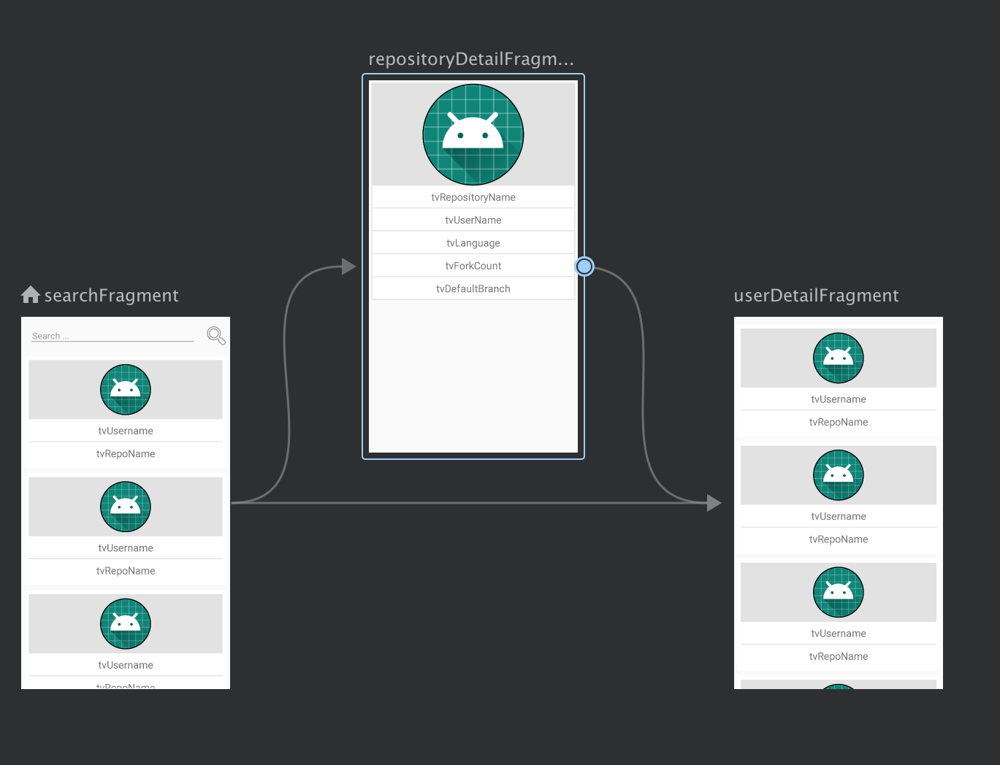

# Github Challenge

## About

## Kotlin and Jetpack Components

## Libs
- [Kotlin](https://kotlinlang.org/docs/reference/android-overview.html)
- [RecyclerView](https://developer.android.com/guide/topics/ui/layout/recyclerview)
- [CardView](https://developer.android.com/reference/androidx/cardview/widget/CardView.html)
- [Navigation Component](https://developer.android.com/guide/navigation)
- [View Model](https://developer.android.com/topic/libraries/architecture/viewmodel)
- [Live Data](https://developer.android.com/topic/libraries/architecture/livedata)
- [Retrofit](https://square.github.io/retrofit/)
- [CircleImageView](https://github.com/hdodenhof/CircleImageView)
- [Glide](https://bumptech.github.io/glide/)